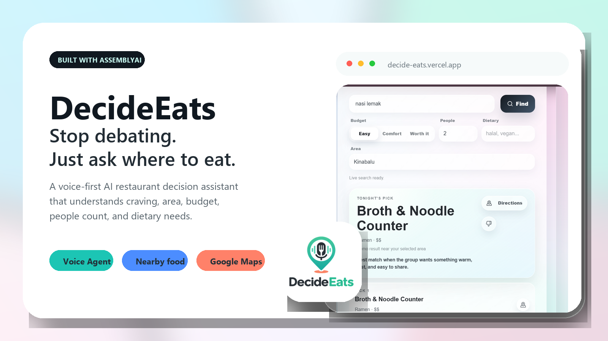
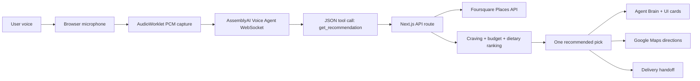

# DecideEats

<p align="center">
  
</p>

<p align="center">
  <strong>Search gives you options. DecideEats gives your group a decision.</strong>
</p>

<p align="center">
  A voice-first food decision agent built with AssemblyAI Voice Agent API for the lablab.ai AssemblyAI Voice Agent Hackathon.
</p>

<p align="center">
  <a href="https://decide-eats.vercel.app/"><strong>Live Demo</strong></a>
  ·
  <a href="https://github.com/jiejie0624/decide-eats"><strong>GitHub</strong></a>
  ·
  <a href="#demo-flow"><strong>Demo Flow</strong></a>
  ·
  <a href="#local-development"><strong>Run Locally</strong></a>
</p>

<p align="center">
  
  
  
  
  
</p>

## What is DecideEats?

DecideEats is a voice-first restaurant decision assistant for people who are tired of asking, “So... what do we eat?”

Instead of returning another long list, DecideEats listens to a natural request, asks only the missing questions, searches nearby restaurants, weighs real constraints, and returns one clear pick with directions and delivery handoff.

It is designed for messy, real-life food decisions:

> “I want makan something pedas near Miri lah, four people, easy budget, halal.”

## Why it matters

Choosing food is rarely a clean search query. People mix cravings, location, budget, group size, dietary needs, and language in one sentence.

DecideEats turns that messy conversation into a decision layer:

| User problem | DecideEats response |
|---|---|
| Too many restaurant options | Returns one best pick, plus backups |
| Group preferences are messy | Considers people count, budget, dietary needs, and craving |
| Voice agents feel like black boxes | Shows an Agent Brain panel with tool activity |
| Local users mix languages | Supports English, Bahasa Melayu, Manglish, and Chinese-style phrases |
| Decision needs action | Opens Google Maps or hands off to Foodpanda / GrabFood / delivery search |

## Highlights

| Feature | Why it matters |
|---|---|
| **AssemblyAI Voice Agent API** | Real-time conversational voice experience in the browser |
| **Barge-in interruption** | Users can interrupt naturally instead of waiting for the agent to finish |
| **JSON tool calling** | Voice requests trigger a real recommendation tool, not just text generation |
| **Agent Brain panel** | Makes the agent’s reasoning and tool flow visible for judges and users |
| **Multilingual / Manglish support** | Understands local phrases like `makan`, `pedas`, `murah`, `辣的`, `便宜` |
| **Smarter ranking** | Uses craving, area, budget, people count, dietary needs, distance, and price estimate |
| **Local currency estimates** | Shows price ranges using the likely currency for the user’s area |
| **Delivery handoff** | Links the chosen restaurant to Foodpanda, GrabFood, or Google delivery search |
| **Google Maps directions** | Moves from decision to action immediately |

## Demo flow

Try this flow in the live demo:

1. Open [decide-eats.vercel.app](https://decide-eats.vercel.app/).
2. Tap the microphone.
3. Allow microphone and location permission.
4. Say:

   ```text
   I am in Miri. I want something spicy, four people, easy budget, halal.
   ```

5. DecideEats fills the visible fields, calls the recommendation tool, and shows one pick.
6. Open **Agent Brain** to see what the voice agent did.
7. Use **Directions** or **Delivery** to continue.

## Product behavior

DecideEats is intentionally not a normal restaurant search app.

```text
Search app:
  query -> many places -> user compares everything

DecideEats:
  voice conversation -> constraints -> tool call -> ranked options -> one decision
```

The app prioritizes user intent in this order:

1. Manual area typed by the user
2. Area spoken by the user
3. Browser GPS location
4. Safe fallback area for demo resilience

## How it works



### AssemblyAI usage

DecideEats uses AssemblyAI as the core voice layer:

- Voice Agent API session
- Real-time voice interaction
- Browser audio streaming over WebSocket
- Turn-taking and natural interruption
- JSON-schema tool calling
- Spoken responses connected to live UI state

## Tech stack

| Layer | Technology |
|---|---|
| App framework | Next.js App Router |
| UI | React, TypeScript, CSS |
| Voice AI | AssemblyAI Voice Agent API |
| Audio capture | Browser microphone + AudioWorklet PCM processor |
| Places data | Foursquare Places API |
| Navigation | Google Maps Directions links |
| Delivery | Foodpanda / GrabFood / Google delivery search handoff |
| Hosting | Vercel |

## Local development

Install dependencies:

```bash
npm install
```

Create your local environment file:

```bash
cp .env.example .env.local
```

Add your own API keys:

```bash
ASSEMBLYAI_API_KEY=your_assemblyai_key
FOURSQUARE_API_KEY=your_foursquare_key
FOURSQUARE_API_VERSION=2025-06-17
DEFAULT_SEARCH_LATITUDE=1.519901
DEFAULT_SEARCH_LONGITUDE=103.6586369
DEFAULT_SEARCH_LABEL=Taman Ungku Tun Aminah
```

Run the development server:

```bash
npm run dev
```

Open:

```text
http://localhost:3000
```

## Environment variables

| Variable | Required | Purpose |
|---|---:|---|
| `ASSEMBLYAI_API_KEY` | Yes | Creates short-lived voice session tokens |
| `FOURSQUARE_API_KEY` | Yes for live places | Searches live nearby restaurants |
| `FOURSQUARE_API_VERSION` | Recommended | Pins the Foursquare Places API version |
| `DEFAULT_SEARCH_LATITUDE` | Optional | Fallback search latitude |
| `DEFAULT_SEARCH_LONGITUDE` | Optional | Fallback search longitude |
| `DEFAULT_SEARCH_LABEL` | Optional | Fallback search label |

Do not prefix secret API keys with `NEXT_PUBLIC_`.

## Verification

Before submitting or deploying:

```bash
npm run lint
npm run build
```

## Deployment

The app deploys as a standard Next.js project on Vercel.

1. Import the GitHub repository into Vercel.
2. Add the environment variables above.
3. Deploy the `master` branch.
4. Test the live URL with microphone and location permission enabled.

## Hackathon positioning

DecideEats was built for the [AssemblyAI Voice Agent Hackathon](https://lablab.ai/ai-hackathons/assemblyai-voice-agent-hackathon) by lablab.ai.

The project is positioned as a **voice-first food decision agent**, not just a restaurant finder.

| Judging angle | What DecideEats shows |
|---|---|
| Application of technology | AssemblyAI Voice Agent, tool calling, interruption, live UI sync |
| Business value | Faster group food decisions, delivery/maps handoff, food platform potential |
| Originality | Agent Brain, Manglish/Chinese/BM support, group-aware decision logic |
| Presentation | Polished glass UI, mobile-ready flow, clear demo story |

## Roadmap

- Deeper group decision mode with one profile per friend
- Saved taste memory and rejected restaurant history
- Stronger restaurant availability / open-now signals
- Direct booking or delivery integrations with official partners
- More robust local language and dish keyterms

## Security notes

- Permanent provider secrets stay in server-side API routes.
- The browser receives only short-lived AssemblyAI voice tokens.
- `.env.local` is ignored and should never be committed.

## Status

DecideEats is a working hackathon prototype with a deployed web app, live restaurant search, voice interaction, visible agent reasoning, Google Maps directions, and delivery handoff.
